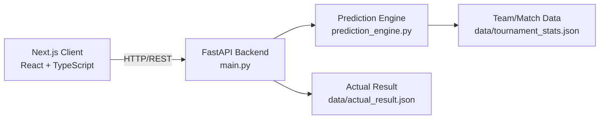

# 🏆 WC2026 Final Predictor

> AI-powered football analytics dashboard predicting the FIFA World Cup 2026 Final matchup between Spain and Argentina — with probability modeling, score simulation, and explainable AI insights.


---

## 🧱 Tech Stack

**Frontend**


**Backend**


**Tooling**


---

## Overview

WC2026 Final Predictor combines statistical modeling, football performance metrics, and probability simulation to forecast the outcome of the World Cup 2026 Final — not just *who wins*, but *why*, through interpretable analytics and AI-generated match reasoning.

Now that the tournament has concluded, the dashboard also compares the model's predictions against the actual final result — Spain 1–0 Argentina (AET) — turning it into a genuine model-evaluation showcase, not just a static forecast.

## 📸 Screenshots


## ✨ Features

- ⚽ Win/draw/loss probability modeling
- 🏁 Prediction vs. actual result comparison (post-final)
- 🎯 Most-likely score prediction with distribution breakdown
- 🥅 Penalty shootout simulation
- 📊 Radar-based team performance comparison (xG, xA, possession, shots)
- 🧠 AI-generated match explanations (strengths, weaknesses, risk factors)
- 📈 Confidence scoring for every prediction
- 🎨 Team-color-coded UI throughout (Spain red, Argentina sky-blue)

## 🏗️ Architecture



## 📡 API Endpoints

### `GET /prediction`
Returns match outcome predictions.

```json
{
  "Spain_win": 45,
  "Draw": 25,
  "Argentina_win": 30,
  "confidence": 72
}
```

### `GET /teams`
Returns team performance statistics — possession, shots per game, shots on target, xG, xA.

### `GET /actual-result`
Returns the real final result for post-match comparison.

```json
{
  "winner": "Spain",
  "score": "1-0",
  "result_type": "extra_time",
  "scorer": "Ferran Torres"
}
```

## 🚀 Getting Started

### Backend
```bash
python -m venv venv
source venv/bin/activate   # Windows: venv\Scripts\activate
pip install -r requirements.txt
python main.py
```

### Frontend
```bash
cd frontend
npm install
npm run dev
```

Visit `http://localhost:3000` to view the dashboard.

## 🗺️ Roadmap

- [x] Backend prediction API
- [x] Frontend dashboard (Next.js)
- [x] Probability, score, and penalty prediction visualization
- [x] AI team profile ratings (radar chart)
- [x] Full visual redesign — team-color-coded across all components
- [x] Post-final "prediction vs. reality" comparison
- [ ] Live data integration (FIFA / football-data APIs)
- [ ] Ensemble ML model (XGBoost, historical World Cup training data)
- [ ] Deployment (Vercel + Render)

## 📄 License

MIT