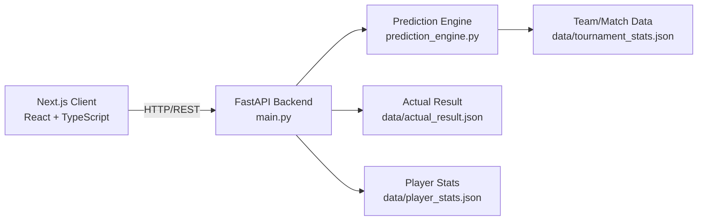

# 🏆 WC2026 Final Predictor

An AI-powered football analytics engine that models the FIFA World Cup 2026 Final matchup using team performance statistics — built and run ahead of the Spain vs. Argentina Final, then evaluated against the actual result.


**🔗 Live demo:** [wc-2026-final-prediction.vercel.app](https://wc-2026-final-prediction.vercel.app)
**🔗 API:** [wc2026-final-prediction.onrender.com](https://wc2026-final-prediction.onrender.com)

> Note: the backend runs on Render's free tier, so the first request after a period of inactivity may take 30–60 seconds to respond while the server wakes up.

---

## 🧱 Tech Stack

**Frontend**


**Backend**


**Deployment**


**Tooling**


---

## Overview

WC2026 Final Predictor is a statistical prediction engine that models match outcomes — win/draw/loss probability, score distribution (via a Poisson distribution model), and penalty shootout odds — from team performance data (xG, xA, possession, form).

The model was run before the 2026 Final between Spain and Argentina. Now that the match has been played, the dashboard also shows the actual result (Spain 1–0 Argentina, AET) alongside the model's original prediction, so you can see exactly how the forecast held up against reality.

## 📸 Screenshots


## ✨ Features

- ⚽ Win/draw/loss probability modeling
- 🏁 Prediction vs. actual result comparison (post-final)
- 🎯 Poisson-based score prediction, mathematically consistent with the win probability model
- 🥅 Penalty shootout simulation
- 📊 Radar-based team performance comparison (xG, xA, possession, shots)
- ⭐ Tournament top scorers & assists leaderboard, plus Player of the Match
- 🧠 AI-generated match explanations (strengths, weaknesses, risk factors)
- 📈 Confidence scoring for every prediction
- 🎨 Team-color-coded UI throughout (Spain red, Argentina sky-blue)

## 🏗️ Architecture


```mermaid
graph LR
    A[Next.js Client<br/>React + TypeScript] -->|HTTP/REST| B[FastAPI Backend<br/>main.py]
    B --> C[Prediction Engine<br/>prediction_engine.py]
    B --> E[Actual Result<br/>data/actual_result.json]
    B --> F[Player Stats<br/>data/player_stats.json]
    C --> D[Team/Match Data<br/>data/tournament_stats.json]
```

**Deployment:** Next.js frontend on Vercel, FastAPI backend on Render, communicating over REST with CORS configured between the two.

## 📡 API Endpoints

### `GET /prediction`
Returns match outcome predictions.

```json
{
  "Spain_win": 38,
  "Argentina_win": 37,
  "Draw": 25,
  "confidence": 53,
  "score_prediction": {
    "most_likely_score": "1-1",
    "score_probabilities": { "1-1": 12.3, "1-0": 9.2, "0-1": 9.0, "2-1": 8.4 }
  }
}
```

### `GET /teams`
Returns team performance statistics — possession, shots per game, shots on target, xG, xA.

### `GET /actual-result`
Returns the real final result for post-match comparison.

```json
{
  "winner": "Spain",
  "score": "1-0",
  "result_type": "extra_time",
  "scorer": "Ferran Torres",
  "player_of_the_match": "Ferran Torres"
}
```

### `GET /players`
Returns tournament top scorers and assists for both finalists.

## 🚀 Getting Started

### Backend
```bash
python -m venv venv
source venv/bin/activate   # Windows: venv\Scripts\activate
pip install -r requirements.txt
python main.py
```

### Frontend
```bash
cd frontend
npm install
npm run dev
```

Set `NEXT_PUBLIC_API_URL` in a `.env.local` file inside `frontend/` if pointing at a deployed backend instead of localhost.

Visit `http://localhost:3000` to view the dashboard.

## 🗺️ Roadmap

- [x] Backend prediction API
- [x] Frontend dashboard (Next.js)
- [x] Probability, score, and penalty prediction visualization
- [x] AI team profile ratings (radar chart)
- [x] Full visual redesign — team-color-coded across all components
- [x] Post-final "prediction vs. reality" comparison
- [x] Poisson-based score model, consistent with win probability
- [x] Player stats & Player of the Match
- [x] Deployment (Vercel + Render)
- [ ] Live data integration (FIFA / football-data APIs)
- [ ] Ensemble ML model (XGBoost, historical World Cup training data)

## 📄 License

MIT